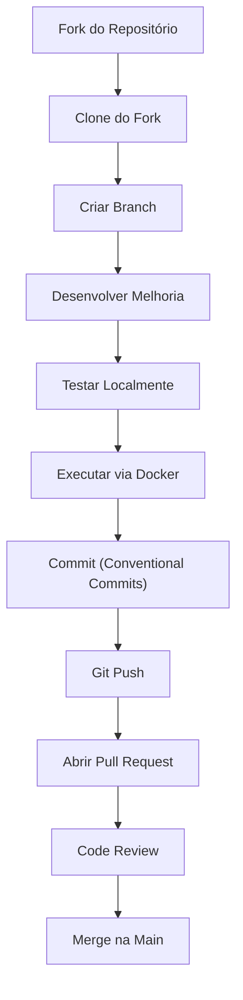

# Desafios Práticos — DevOps

---

## Projeto Integrador: Site Orc

Durante esta trilha, o participante será responsável por preparar, executar, compreender e contribuir com o projeto institucional da Orc'estra (**Site-Orc**) utilizando boas práticas de DevOps, Git, Docker e integração contínua.

---

## 1. Apresentação do Projeto Integrador

**Nome do projeto:** Site Orc

**Descrição:** O Site-Orc é o portal institucional da Orc'estra e será utilizado como projeto integrador da trilha de DevOps. O foco desta capacitação não será desenvolver uma nova aplicação, mas compreender o fluxo completo de desenvolvimento utilizado pela empresa, desde a preparação do ambiente até a entrega de novas funcionalidades.

Durante a trilha, os participantes irão trabalhar de maneira indireta no repositório oficial, fazendo um fork, aprendendo a configurar o ambiente de desenvolvimento, versionar código, executar a aplicação localmente e em containers Docker, automatizar verificações utilizando GitHub Actions e contribuir com melhorias reais através de Pull Requests.

Ao final da capacitação, cada participante terá realizado uma contribuição no projeto seguindo o fluxo oficial adotado pela DiProj.

### Funcionalidades Mínimas

Ao longo da trilha, cada participante deverá contribuir com pelo menos uma melhoria no projeto, como:

- Correção de bugs;
- Melhorias de responsividade;
- Ajustes visuais e de usabilidade;
- Atualização de componentes React;
- Organização e refatoração de código;
- Melhorias na documentação;
- Correção de problemas identificados pela equipe;
- Configuração e melhoria da automação do projeto.

---

## 2. Estrutura da Trilha Prática

| Etapa | Tema | Descrição | Materiais |
| :---: | ----- | ----- | ----- |
| **1** | Preparação para o projeto | Configurar o ambiente de desenvolvimento para trabalhar no Site-Orc. Realizar o Fork do repositório, configurar Git, SSH, Node.js e Docker Desktop. Clonar o projeto, instalar as dependências e validar a execução local da aplicação. | GitHub; Node.js; Docker Desktop; VS Code; React; Vite |
| **2** | Git e branches | Organizar o desenvolvimento utilizando Git Flow. Configurar os repositórios `origin` e `upstream`, criar branches para novas funcionalidades, correções, documentação e automações. Trabalhar sempre através de Pull Requests. | Git; GitHub Skills; documentação Git |
| **3** | Padronização de commits | Utilizar Conventional Commits para organizar o histórico do projeto. Aplicar os tipos `feat`, `fix`, `docs`, `style`, `refactor`, `ci`, `test` e `chore`, facilitando a rastreabilidade das alterações e o versionamento automático. | Conventional Commits; Commitlint |
| **4** | Estrutura do projeto | Compreender a arquitetura do Site-Orc. Identificar a organização das pastas, componentes React, páginas, assets, rotas, arquivos de configuração e fluxo da aplicação antes de realizar alterações. | React; Vite; React Router; documentação do projeto |
| **5** | Docker | Compreender a conteinerização da aplicação. Analisar o `Dockerfile` e o `docker-compose.yml`, construir a imagem Docker, executar o projeto em containers e validar seu funcionamento em ambiente isolado. | Docker Desktop; Docker Docs; Docker Compose |
| **6** | Qualidade e troubleshooting | Executar lint, validar o build da aplicação, identificar erros comuns de desenvolvimento e utilizar logs para diagnosticar problemas de execução, dependências, containers e configuração do ambiente. | ESLint; Docker Logs; Vite |
| **7** | Integração contínua | Criar ou manter workflows no GitHub Actions para instalar dependências, executar lint, validar o build e automatizar verificações sempre que um Pull Request for aberto. | GitHub Actions; YAML |
| **8** | Versionamento e documentação | Atualizar a documentação do projeto, manter o README organizado, documentar novas funcionalidades e seguir o padrão de versionamento adotado pela equipe. | README; CONTRIBUTING; Semantic Versioning |
| **9** | Contribuição para o projeto | Desenvolver uma melhoria real no Site-Orc utilizando todo o fluxo aprendido: criar uma branch, implementar a alteração, executar testes locais, validar a aplicação via Docker, abrir um Pull Request e participar da revisão de código. | Repositório Site-Orc; GitHub |

---

## 3. Detalhamento das Etapas

### Etapa 1 — Preparação do Projeto

**Objetivo:** Preparar o ambiente de desenvolvimento e configurar o repositório do Site-Orc, garantindo que todos os participantes consigam executar a aplicação localmente e iniciar o desenvolvimento seguindo o fluxo adotado pela DiProj.

#### Atividades
1. Instalar o Git na máquina;
2. Instalar o Node.js (versão LTS);
3. Instalar o Visual Studio Code (ou IDE da sua preferência);
4. Instalar o Docker Desktop;
5. Configurar o Git (`user.name` e `user.email`);
6. Gerar e configurar uma chave SSH no GitHub;
7. Realizar o **Fork** do repositório oficial do Site-Orc;
8. Clonar o repositório utilizando SSH;
9. Abrir o projeto no Visual Studio Code;
10. Instalar as dependências do projeto (`npm install`);
11. Executar a aplicação localmente (`npm run dev`);
12. Verificar se a aplicação está funcionando corretamente no navegador;
13. Analisar a estrutura inicial do projeto e identificar os principais diretórios e arquivos.

**Estrutura esperada:**
```text
Site-Orc/  
├── public/  
├── src/  
│   ├── assets/  
│   ├── components/  
│   ├── pages/  
│   ├── routes/  
│   ├── App.jsx  
│   └── main.jsx  
├── Dockerfile  
├── docker-compose.yml  
├── package.json  
├── vite.config.js  
├── README.md  
└── .gitignore
```

#### Competências Desenvolvidas
- Configurar corretamente o ambiente de desenvolvimento;
- Utilizar Git e GitHub para acessar o projeto;
- Compreender a estrutura inicial de uma aplicação React com Vite;
- Executar a aplicação localmente;
- Identificar os principais arquivos responsáveis pela configuração do projeto.

#### Entregável
- Fork do repositório criado em sua conta do GitHub;
- Projeto clonado utilizando SSH;
- Aplicação executando localmente;
- Print da aplicação em funcionamento;
- Estrutura do projeto identificada e compreendida.

---

### Etapa 2 — Organização do Repositório e Fluxo Git

**Objetivo:** Aprender o fluxo de versionamento utilizado pela DiProj, compreendendo como contribuir para projetos colaborativos utilizando Git e GitHub.

#### Atividades
1. Configurar o repositório remoto (`origin`) apontando para o Fork criado na etapa anterior.
2. Adicionar o repositório oficial da DiProj como remoto (`upstream`).
3. Atualizar o Fork utilizando as alterações do repositório oficial.
4. Criar uma branch de desenvolvimento seguindo o padrão definido pela equipe.
5. Compreender quando utilizar branches de feature, fix, docs e refactor.
6. Registrar pequenas alterações utilizando commits semânticos.
7. Enviar as alterações para o GitHub.
8. Abrir um Pull Request para revisão.

#### Entregáveis
- Fork sincronizado com o repositório oficial.
- Branch criada corretamente.
- Pull Request aberto.

#### Tipos de Commit (Especificação Conventional Commits v1.0.0):

Pela especificação oficial do **Conventional Commits**, todos os tipos devem ser obrigatoriamente escritos em letras minúsculas:

| Tipo | Utilização | Exemplo Prático |
| :--- | :--- | :--- |
| `feat` | Nova funcionalidade para o usuário | `feat: adiciona cadastro de tarefas` |
| `fix` | Correção de um bug ou erro no código | `fix: corrige soma da pontuação` |
| `docs` | Alterações exclusivamente na documentação | `docs: adiciona instruções de instalação` |
| `style` | Alterações de formatação ou estilo sem alterar código | `style: ajusta espaçamento dos botões` |
| `refactor` | Refatoração de código sem alterar regra de negócio | `refactor: simplifica função de filtro` |
| `test` | Criação ou alteração de testes automatizados | `test: adiciona testes do serviço de tarefas` |
| `ci` | Alterações na automação, pipelines ou GitHub Actions | `ci: configura pipeline no GitHub Actions` |
| `chore` | Tarefas auxiliares de manutenção ou build | `chore: atualiza pacotes do package.json` |

#### Boas Práticas para Commits:
- Realizar commits pequenos e objetivos.
- Cada commit deve representar uma única alteração lógica.
- Escrever mensagens claras e descritivas.
- Utilizar verbos no presente (ex.: `adiciona`, `corrige`, `remove`).
- Evitar commits genéricos como `ajustes`, `teste` ou `update`.
- Antes de realizar o commit, revisar as alterações utilizando `git diff` ou `git status`.

---

### Etapa 3 — Estrutura da Aplicação

**Objetivo:** Compreender como o Site-Orc foi organizado e identificar a função dos principais arquivos da aplicação.

#### Atividades
Explorar toda a estrutura do projeto e identificar a estrutura de pastas, componentes reutilizáveis, páginas, assets, rotas e arquivos de configuração (`package.json`, `vite.config.js`, `App.jsx`, `main.jsx`, `Dockerfile`, `docker-compose.yml`). Produzir um pequeno documento explicando a arquitetura.

#### Entregáveis
Documento contendo a descrição da arquitetura da aplicação.

---

### Etapa 4 — Desenvolvimento e Organização do Código

**Objetivo:** Compreender como novas funcionalidades são adicionadas ao projeto mantendo a organização do código.

#### Atividades
Selecionar uma melhoria simples previamente definida pela equipe (corrigir textos, melhorar responsividade, ajustar componentes, reorganizar arquivos, melhorar acessibilidade). Seguir os padrões definidos pela equipe e validar localmente.

#### Entregáveis
Funcionalidade implementada e validada localmente.

---

### Etapa 5 — Docker e Ambiente de Desenvolvimento

**Objetivo:** Containerizar a aplicação e compreender como Docker facilita a padronização do ambiente de desenvolvimento.

#### Atividades
Analisar o Dockerfile existente, compreender imagem base, diretório de trabalho, instalação de dependências, build e inicialização. Executar a aplicação via Docker Compose e comparar com a execução local.

#### Entregáveis
Aplicação executando corretamente via Docker.

---

### Etapa 6 — Qualidade do Projeto

**Objetivo:** Garantir que todas as alterações realizadas estejam de acordo com os padrões de qualidade adotados pela DiProj.

#### Atividades
Executar as ferramentas de validação, verificar erros de lint, warnings, build e organização do código, realizando as correções necessárias.

#### Entregáveis
Projeto executando sem erros de lint e sem falhas de build.

---

### Etapa 7 — Troubleshooting

**Objetivo:** Desenvolver a capacidade de identificar e solucionar problemas comuns encontrados durante o desenvolvimento (dependências ausentes, conflitos, portas em uso, falhas de Docker/build).

#### Entregáveis
Relatório contendo os problemas encontrados e suas respectivas soluções (descrição, causa e solução aplicada).

---

### Etapa 8 — Integração Contínua

**Objetivo:** Compreender como automatizar verificações utilizando GitHub Actions, garantindo maior qualidade nas contribuições realizadas ao projeto.

#### Atividades
Analisar ou criar workflows para instalar dependências, executar lint e validar o build automaticamente em Pull Requests.

#### Entregáveis
Pipeline executando corretamente no GitHub Actions.

---

### Etapa 9 — Contribuição Final para o Projeto

**Objetivo:** Aplicar todos os conhecimentos adquiridos durante a trilha contribuindo diretamente para o Site-Orc.

#### Atividades
Atualizar Fork, criar nova branch, implementar melhoria aprovada, validar localmente e via Docker, realizar commits padronizados e abrir Pull Request detalhado para revisão.

#### Entregáveis
- Fork atualizado;
- Branch criada;
- Pull Request enviado;
- Evidências da execução local e via Docker;
- Código revisado pela equipe.

---

## 4. Entrega Final e Avaliação

### Itens de Entrega Final
- Link do Fork do repositório Site-Orc;
- Link do Pull Request contendo a contribuição realizada;
- Evidências da aplicação executando localmente;
- Evidências da aplicação executando via Docker;
- Registro das principais dificuldades encontradas e soluções aplicadas;
- Documentação atualizada, quando necessário.

### Critérios de Avaliação
Para aprovação na trilha, o participante deverá demonstrar capacidade de:
- Configurar corretamente o ambiente (Git, Node.js, Docker);
- Executar o Site-Orc localmente e em containers Docker;
- Utilizar o fluxo de versionamento da DiProj (Fork, branch, commits padronizados, PR);
- Desenvolver uma melhoria no projeto seguindo os padrões da equipe;
- Resolver problemas básicos de desenvolvimento (troubleshooting);
- Documentar alterações e aceitar sugestões de Code Review.

### Competências Desenvolvidas
- Configuração de ambiente de desenvolvimento web;
- Fluxo de colaboração com Git e GitHub;
- Arquitetura do projeto Site-Orc (React + Vite);
- Conteinerização de aplicações com Docker;
- Diagnóstico e resolução de problemas (Troubleshooting);
- Boas práticas de desenvolvimento colaborativo.

---

## 5. Fluxo de Contribuição no GitHub



---

[← Voltar para a Visão Geral](index.md){ .md-button }
